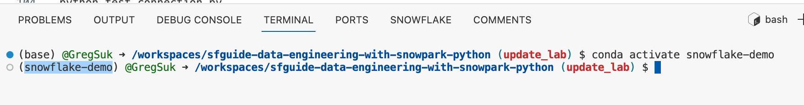

# Tasty Bytes - Snowpark 101 for Data Science

## Overview

In this Snowpark 101 for Data Science guide, you will help the fictitious food truck company, Tasty Bytes, to increase sales by training a model to provide location recommendations to truck drivers. You will use **Snowpark for Python** to prepare data, train a model, and deploy the model. Once deployed, you will create an application prototype using **Streamlit** to demonstrate how truck drivers could use the model to find the best location to park for an upcoming shift.

## Prerequisites

For prerequisites, environment setup, please refer to the [Snowpark Python Prerequisites](../../prerequisites.md).

## Step-by-Step Guide

This document contains the overview and lab instructions for *Snowpark Data Science Lab* code contained in this repository.

## Step 1 - Setup Snowflake

This step will create the necessary role, warehouse, database, and schemas for the hands-on lab, if not already created from the Data Engineering Lab. We will create 3 schemas for our data maturity model; RAW, HARMONIZED, and ANALYTICS. It will also create and load the tables we will be utilizing for the streamlit application and Jupyter notebook.

Before executing the SQL script, ensure you are logged into Snowflake via the extension in Codespaces. Select the Snowflake icon in the left navigation bar and verify you are connected, otherwise log in with your credentials. Once logged in, open the `steps/00_data_science_lab_lab/setup_snowflake.sql` script by going to the file Explorer in the left navigation bar.

To run all the queries in this script, use the "Execute All Statements" button in the upper right corner of the editor window.

Note: In order to "activate" the Execute Statements icons you may need to click anywhere in the file, you will see the icons turn to a black outline from light gray.

## Step 2 - Run Snowpark Data Science Notebook

### Install Jupyter

Open the Extensions tab in the left sidebar and search for "jupyter" to find Jupyter extension developed by Microsoft, then install it. 


### Open Notebook and Select Kernel

Open the `steps/12_data_science_snowpark_101.ipynb` notebook in Codespaces from the file Explorer in the left navigation bar.  

In the top right, click the "Select Kernel," then click "Python Environments."


The dialog box should now say "Select a Python Environment."  Click the small reload icon in the top right of the dialog box, then select the **"snowflake-demo (python 3.10.12)"** kernel.


## Step 3 - Run Streamlit Application Prototype

### step 1 - Confirming Prerequisites
The Streamlit App leverages the Python environment, authentication file, and user-defined function from Step 3. 

Step 3 - Launching the App

Ensure your Conda environment is active by going to the terminal. You should see `(snowflake-demo)` in front of your user name.



If you see `(base)` instead, run the following command in the terminal
```
conda activate snowflake-demo
```
Once the conda environment is active, Launch the application with the following commands.
```
cd steps/00_data_science_lab
streamlit run streamlit_app.py  --server.enableCORS false --server.enableXsrfProtection false
```

Note: All of the packages for this application have already been installed in the Conda environment via the conda_env.yml. Additionally, the `--server` arguments in the streamlit run command are specific to launching the streamlit app and using github's compute. If running streamlit locally, these are not necessary.

Use the drop down menu to select a city and view the updated recommendations.

To stop the Streamlit App run:
```
ctrl + c
```